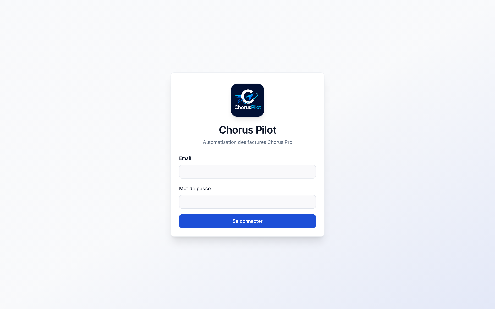
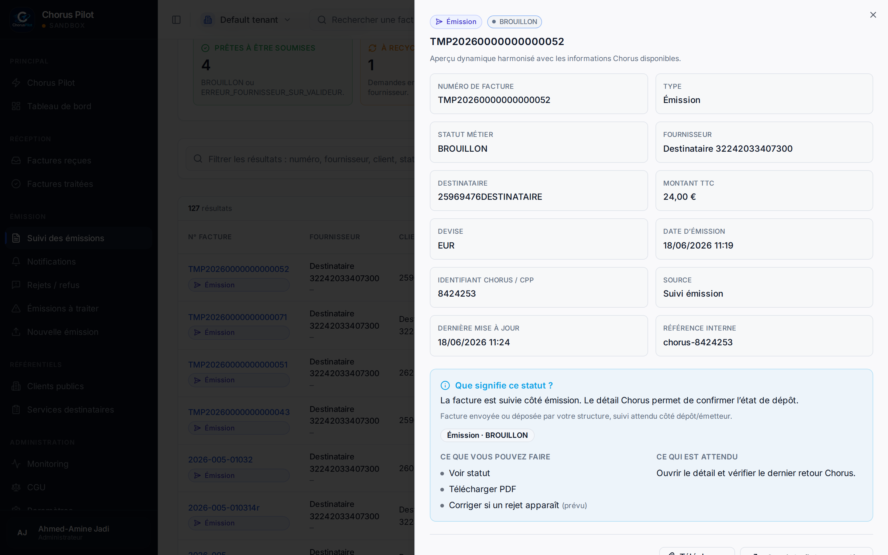
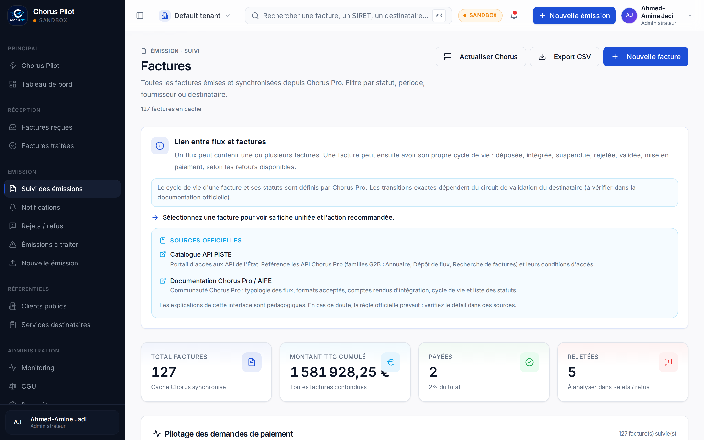
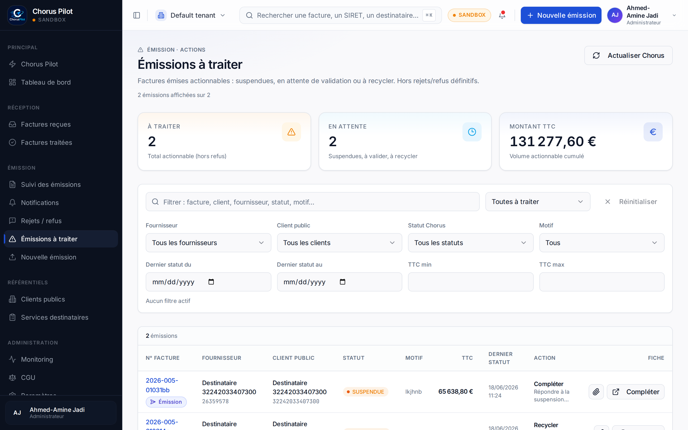
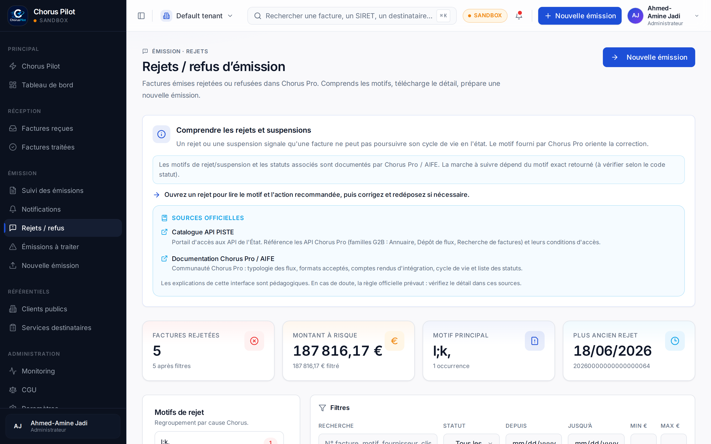
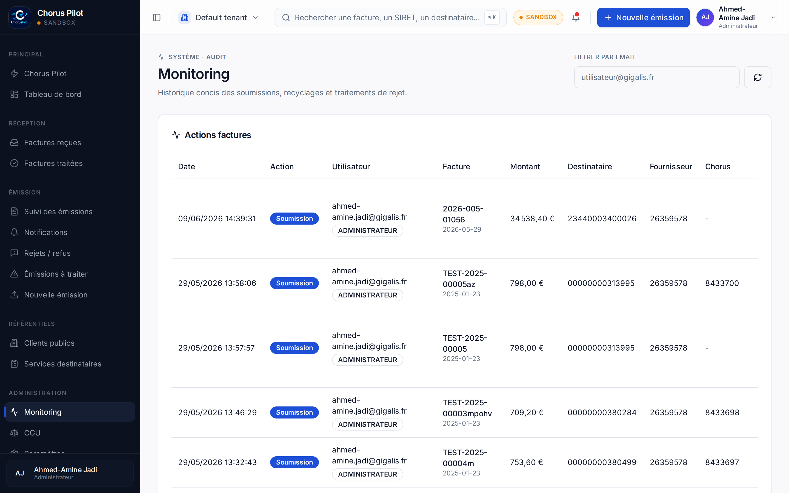

# E-Invoicing Platform — Chorus Pro / PISTE

> **Plateforme web full-stack d'industrialisation de la facturation électronique** vers Chorus Pro (portail de l'État français) via les API PISTE.
> Préparation, contrôle, génération de flux (UBL), soumission et suivi des factures du secteur public.

> **EN — TL;DR:** A full-stack web platform that automates French public-sector e-invoicing. It ingests invoices (incl. PDF extraction), validates and normalizes them, generates compliant **UBL** flows, submits them to **Chorus Pro** through the government **PISTE** OAuth2 gateway, and tracks their lifecycle. Built with **React + TypeScript** (frontend) and **FastAPI + PostgreSQL** (backend), containerized with Docker.

---

> ℹ️ **À propos de ce dépôt / About this repository**
> Ceci est une **vitrine technique** (*portfolio showcase*) : un extrait **curé et anonymisé** d'un projet professionnel réel.
> **Ce n'est qu'un petit aperçu de l'ensemble du travail réalisé** — le projet complet est nettement plus vaste (frontend complet, API, base de données, synchronisation, déploiement). Seule une fraction représentative est présentée ici.
> Aucun secret, identifiant, donnée client ou configuration de production n'y figure. Les captures d'écran utilisent des **données de test**.
> *This is a curated, sanitized extract of a real professional project, shared for portfolio purposes. **It is only a small taste of the full body of work** — the complete project is substantially larger (full frontend, API, database, sync, deployment); only a representative fraction is shown here. No secrets, credentials, client data, or production configuration are included; screenshots use synthetic test data.*

---

## Sommaire

- [Le problème métier](#le-problème-métier)
- [Aperçu de l'application](#aperçu-de-lapplication)
- [Fonctionnalités clés](#fonctionnalités-clés)
- [Architecture](#architecture)
- [Stack technique](#stack-technique)
- [Points d'ingénierie mis en avant](#points-dingénierie-mis-en-avant)
- [Code présenté ici](#code-présenté-ici)
- [Mon rôle](#mon-rôle)

---

## Le problème métier

Depuis la généralisation de la facturation électronique dans le secteur public français, toute facture à destination d'une entité publique doit transiter par **Chorus Pro**, via la plateforme d'API **PISTE**. Le dépôt manuel, facture par facture, est lent, source d'erreurs et difficile à tracer.

Cette plateforme **industrialise** ce processus de bout en bout :

- récupération et synchronisation des factures et des référentiels (annuaire des structures publiques) ;
- préparation d'une facture à partir d'un PDF (extraction de texte et des champs métier) ;
- contrôle et normalisation des données (SIRET, destinataire, service exécutant, montants, TVA) ;
- génération d'un flux conforme (**UBL**) et soumission via les API Chorus Pro ;
- suivi des statuts, des rejets et de l'activité (audit, monitoring).

Le tout en respectant une règle de sécurité non négociable : **le navigateur n'appelle jamais Chorus directement avec des secrets** — tout passe par un backend qui détient les identifiants techniques.

## Aperçu de l'application

| Connexion | Tableau de bord & détail facture |
| --- | --- |
|  |  |

| Liste des factures | Factures à traiter |
| --- | --- |
|  |  |

| Rejets & analyse | Monitoring |
| --- | --- |
|  |  |

*(Toutes les captures utilisent des données de test — codes destinataire et numéros de facture fictifs.)*

## Fonctionnalités clés

- **Cycle de vie complet de la facture** — réception, préparation, contrôle, soumission, suivi des statuts et gestion des rejets.
- **Extraction depuis PDF** — extraction du texte et reconnaissance des champs métier pour pré-remplir une facture.
- **Génération de flux UBL** — sérialisation XML conforme au profil de dépôt Chorus Pro.
- **Connexion sécurisée à PISTE** — authentification OAuth2 côté serveur, secrets jamais exposés au navigateur.
- **Architecture multi-fournisseurs (provider pattern)** — Chorus Pro aujourd'hui, prêt pour les futures Plateformes de Dématérialisation Partenaires (**PDP**) du B2B, avec un fournisseur *mock* pour les tests.
- **Référentiels & synchronisation** — annuaire des structures publiques, synchronisation périodique (cron), cache.
- **Rôles & sécurité applicative** — authentification JWT, rôles serveur (`AUDITEUR`, `DEPOSANT`, `GESTIONNAIRE`, `ADMINISTRATEUR`).
- **Audit & monitoring** — journalisation des appels API, écrans de suivi de l'activité et des jobs.

## Architecture

```text
Navigateur (React SPA)
  │  HTTPS
  ▼
nginx (reverse proxy)
  ├─ sert l'app React statique
  └─ /api/*  ──►  FastAPI (Python)
                   ├─ Auth JWT
                   ├─ Extraction PDF
                   ├─ Provider routing  ──►  Chorus Pro / PISTE (OAuth2)
                   │                          │
                   │                          └─ génération UBL + upload + soumission
                   └─ API DB  ──►  PostgreSQL (référentiels, factures, jobs, audit)

Stack conteneurisée : nginx · API FastAPI · migrations Alembic · PostgreSQL
```

Détails dans **[docs/ARCHITECTURE.md](docs/ARCHITECTURE.md)**.

## Stack technique

**Frontend**
- React 18 + TypeScript + Vite
- shadcn/ui (Radix UI) + Tailwind CSS
- TanStack Query (data fetching/caching), React Hook Form + Zod (formulaires & validation)
- Recharts (visualisations)

**Backend**
- Python 3.12 + FastAPI
- PostgreSQL + SQLAlchemy + Alembic (migrations)
- Authentification JWT + bcrypt
- Intégration Chorus Pro via OAuth2 / PISTE, génération UBL

**Infrastructure**
- Docker / Docker Compose, nginx
- Synchronisation planifiée (cron), volumes Postgres persistants

## Points d'ingénierie mis en avant

- **Séparation stricte des secrets** — aucun identifiant Chorus/PISTE ne touche le navigateur ; le frontend ne parle qu'au backend, qui détient les credentials.
- **Provider pattern extensible** — une interface `InvoiceProvider` (Protocol Python) abstrait le canal de soumission. Ajouter une future PDP B2B revient à implémenter une classe ; le `RoutingService` choisit le bon fournisseur selon le canal. Voir [`code/backend/providers/`](code/backend/providers/).
- **Mapping de statuts robuste** — traduction des statuts hétérogènes de Chorus Pro vers un modèle de statuts interne stable et lisible par l'utilisateur. Voir [`code/backend/invoicepilot/statuses.py`](code/backend/invoicepilot/statuses.py).
- **Validation en couches** — validation Zod côté frontend *et* validation métier côté backend avant tout appel externe.
- **Messages d'erreur orientés métier** — les erreurs techniques de l'API sont traduites en messages actionnables pour l'utilisateur (ex. SIRET destinataire invalide, structure fournisseur mal configurée). Voir [`code/backend/errors.py`](code/backend/errors.py).
- **Typage de bout en bout** — TypeScript strict côté frontend, *dataclasses* typées et `Decimal` (montants) côté backend.

## Code présenté ici

Ce dépôt présente un **extrait représentatif** du code — un simple aperçu, **pas** l'application complète. L'application réelle est bien plus étendue ; les fichiers ci-dessous ont été choisis pour illustrer l'architecture et la qualité, sans exposer de logique métier propriétaire ni de configuration.

```
code/
├── backend/                      # Python / FastAPI
│   ├── providers/                # Provider pattern : abstraction du canal de soumission
│   │   ├── base.py               #   interface InvoiceProvider + types de domaine
│   │   ├── chorus_pro.py         #   implémentation Chorus Pro
│   │   ├── future_pdp.py         #   placeholder PDP B2B
│   │   └── mock.py               #   fournisseur de test
│   ├── invoicepilot/             # Couche service
│   │   ├── routing_service.py    #   sélection du fournisseur selon le canal
│   │   ├── statuses.py           #   modèle de statuts + mapping Chorus → interne
│   │   ├── validation_service.py
│   │   ├── status_service.py
│   │   └── invoice_service.py
│   ├── chorus_ubl_generator.py   # génération XML/UBL conforme
│   └── errors.py                 # traduction erreurs techniques → messages métier
└── frontend/                     # React / TypeScript
    ├── types/chorus.ts           # types du domaine Chorus
    ├── lib/chorus/               # logique métier frontend
    │   ├── buildSubmissionPayload.ts
    │   ├── validateSubmissionPayload.ts
    │   ├── normalization.ts
    │   └── types.ts
    ├── hooks/                    # hooks React réutilisables
    └── components/flux/          # composants UI du pipeline de facturation
```

## Mon rôle

Conception et développement **full-stack** de la plateforme : architecture frontend et backend, intégration des API Chorus Pro / PISTE, génération des flux UBL, modèle de données PostgreSQL, et conteneurisation Docker pour le déploiement.

---

*Réalisé par **Ahmed-Amine Jadi**. Extrait de portfolio — données et secrets retirés.*
